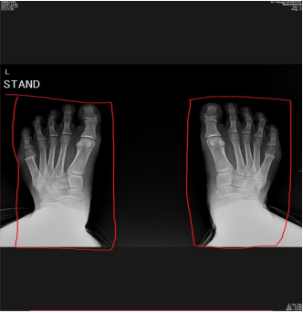
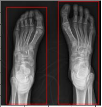
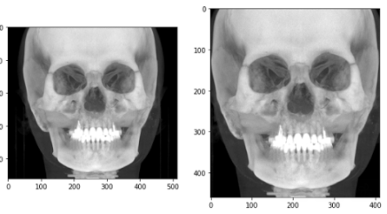
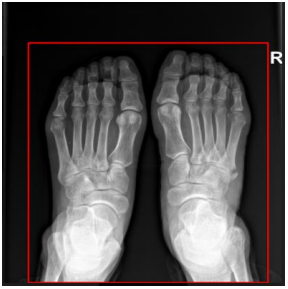
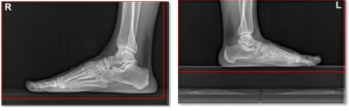

# Smart-Fit

The goal is to:
- To find a minimum area containing a meaningful part
- Identify separate parts and save each part in separate dicom scan along with the original series.  
  
## Algorithm  
- A window with WL = default WL of scan and WW = 80% of default WW value i.e. WW = 0.8 * default WW was applied to get a better contrast.
- Adaptive thresholding considers a small set of neighboring pixels at a time, computes threshold for that specific local region, and then performs the segmentation. Hence, segmenting the object even for varying lightning conditions within an image which was the case in most of the scans.
- To remove noise, a Gaussian blur was applied with a kernel size of [13 13] and sigma = 0.
- Applying Gaussian blur makes the edges of objects smooth. To get distinct edges we applied morphological gradient. A morphological gradient is the difference between the dilation and the erosion of a given image. It is an image where each pixel value indicates the contrast intensity in the close neighborhood of that pixel.
- Finding contours is like finding white object from black background. Therefore, we found and drew contours.
- Removing Boundary Pixels: 50 pixels from image boundary that is top bottom left and right were removed to get rid of bright boundary lines that are visible in some scans. These boundaries have the same intensity values as the objects.
- Closing can remove small dark spots and connect small bright cracks. Therefore, morphological closing was applied to get better segmentation of objects.
- Found the contours and drew bounding rects of those contours. Applied the threshold on contour area while drawing bounding rects as the objects are relatively bigger in size.
- Cropped the region inside each bounding rect and saved each object as a dicom file.  
#### Output of algorithm:  
  
  
## Scans which can be processed:  
We can get an output for following types of scans:
- Scans with Transfer Syntax UID [ Tag (0002,0010)] = Explicit VR Little Endian
- Scans with Transfer Syntax UID [ Tag (0002,0010)] = Implicit VR Little Endian
- Scans with Transfer Syntax UID [ Tag (0002,0010)] = Explicit VR Big Endian
- Scans with Transfer Syntax UID [ Tag (0002,0010)] = JPEG Lossless, Non-Hierarchical, First-Order Prediction (Process 14 [Selection Value 1])  
All scan types had total 16 bits allocated [Tag (0028,0100)] but the number of stored bits [Tag (0028,0101)] were different. Scans had the values of 12, 14 and 16 bits for tag (0028,0101).  
The algorithm was not tested for any scan type other than the above listed so it may or may not perform on them.  
## Saving cropped Dicoms:  
After identification of objects and minimum ROI, we cropped the identified area from scan, updated the related tags like Rows, Columns etc. and saved it as a new Dicom file. So for instance, if we have a dicom “abc.dcm”, after identification the new cropped scan will be saved as “abc_1.dcm” and if 2 objects are detected the 2nd object will be saved as “abc_2.dcm” along with the original scan “abc.dcm” in same series. But if the cropped scan area (rows*columns) is greater than 70 percent of original scan area, then only the original scan will be saved.  
### Algorithm:  
We followed following techniques to save scans.  
#### For Explicit VR Little Endian, Implicit VR Little Endian and Explicit VR Big Endian:  
- For instance, we load a scan “abc.dcm”, the algorithm will:
  - Save “abc.dcm” in the output folder.
  - Create a copy of original scan.
  - Equate the pixel data of the copy to modified pixel data
  - Equate the Rows and columns tag to new rows and columns.
  - Modify the following tags of the copy to save the copy in same series as original scan:
    - (0020,0011) Series Number
    - (0020,000E) Series Instance UID
    - (0008,0018) SOP Instance UID
    - (0002,0003) Media Storage SOP Instance UID
  - All the other tags will be exactly the same as original.
  - Save the copy as “abc_1.dcm”, it will be the output dicom scan <br/ >
#### For JPEG Lossless, Non-Hierarchical, First-Order Prediction (Process 14 [Selection Value 1]) with 12 Bits Stored:  
- If we load a scan “abc.dcm”, the algorithm will:
  - Save “abc.dcm” in the output folder.
  - Create a copy of original scan.
  - The cropped pixel array will first be encoded in JPEG 12 bit format and then encapsulated to give us modified pixel data.
  - Equate the pixel data of the copy to modified pixel data.
  - Equate the Rows and columns tag to new rows and columns.
  - Modify the following tags of the copy to save the copy in same series as original scan:
    - (0020,0011) Series Number
    - (0020,000E) Series Instance UID
    - (0008,0018) SOP Instance UID
    - (0002,0003) Media Storage SOP Instance UID
  - All the other tags will be exactly the same as original.
  - Save the copy as “abc_1.dcm”, it will be the output dicom scan

#### For JPEG Lossless, Non-Hierarchical, First-Order Prediction (Process 14 [Selection Value 1]) with 14 Bits and 16 Bits Stored:  
- If we load a scan “abc.dcm”, the algorithm will:
  - Save “abc.dcm” in the output folder.
  - Create a copy of original scan.
  - Equate the pixel data of the copy to modified pixel data
  - Equate the Rows and columns tag to new rows and columns.
  - Modify the following tags of the copy to save the copy in same series as original scan:
    - (0020,0011) Series Number
    - (0020,000E) Series Instance UID
    - (0008,0018) SOP Instance UID
    - (0002,0003) Media Storage SOP Instance UID
  - Change the Transfer Syntax UID [ Tag (0002,0010)] to Explicit VR Little Endian [1.2.840.10008.1.2.1].
  - All the other tags will be exactly the same as original.
  - Save the copy as “abc_1.dcm”, it will be the output dicom scan in Explicit VR Little Endian Format instead of original JPEG Lossless format.  

## Reason for different techniques:
Scans in Endian format can be saved easily by just modifying the pixel data and equating it to pixel array. For JPEG lossless format the pixel array should first be encoded in the specific bit format and then encapsulated before equating the pixel data to pixel array. In python, to save a compressed dicom i.e. in the form of JPEG lossless transfer syntax, we need to encode the pixel data in JPEG 12 or 8 bit format. To be encoded in the mentioned format the pixel data must be 12 bit or less. In other words, no value in the scan should be greater than 4096, which is not the case for 14 bits and 16 bits stored JPEG lossless transfer syntax. Therefore, we used Explicit Little Endian Transfer Syntax as mentioned above to save 14 bits and 16 bits jpeg lossless scans.

## Limitations of algorithm:  
For following cases the algorithm will not save the cropped scan. 
- As we’re applying a threshold while saving scans that if the resultant crop has atleast 30% lesser area than the original only then it will be saved.
- For feet as close as we can see here, the current algorithm detects it as one.  
  
- For scans as shown below, where the foot is on some surface, it gives a broader  
  
